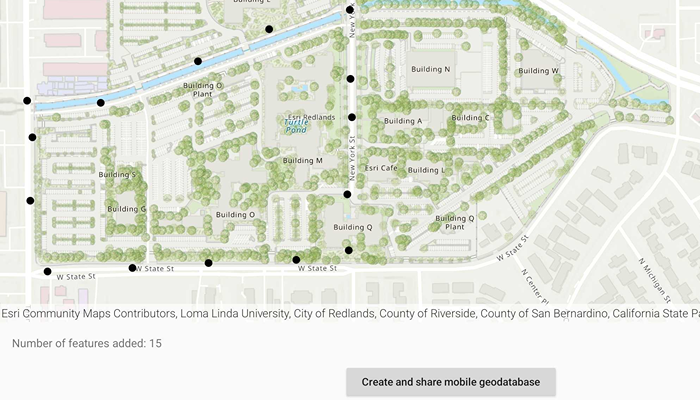
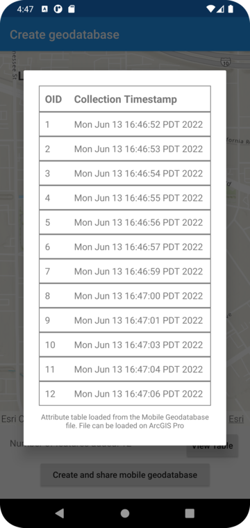

# Create mobile geodatabase

Create and share a mobile geodatabase.

 

## Use case

A mobile geodatabase is a collection of various types of GIS datasets contained in a single file (`.geodatabase`) on disk that can store, query, and manage spatial and nonspatial data. Mobile geodatabases are stored in an SQLite database and can contain up to 2 TB of portable data. Users can create, edit and share mobile geodatabases across ArcGIS Pro, ArcGIS Runtime, or any SQL software. These mobile geodatabases support both viewing and editing and enable new offline editing workflows that don’t require a feature service.

For example, a user would like to track the location of their device at various intervals to generate a heat map of the most visited locations. The user can add each location as a feature to a table and generate a mobile geodatabase. The user can then instantly share the mobile geodatabase to ArcGIS Pro to generate a heat map using the recorded locations stored as a geodatabase feature table.

## How to use the sample

Tap on the map to add a feature symbolizing the user's location. Tap "View table" to view the contents of the geodatabase feature table. Once you have added the location points to the map, click on "Create and share mobile geodatabase" to retrieve the `.geodatabase` file which can then be imported into ArcGIS Pro or opened in an ArcGIS Runtime application.

## How it works

1. Create and load the `Geodatabase` from the mobile geodatabase location on file.
2. Create a new `TableDescription` and add the list of `FieldDescription`s to the table.
3. Add the `TableDescription` to the geodatabase using `Geodatabase.createTableAsync()`.
4. Load the first `GeodatabaseFeatureTables` as an `GeodatabaseFeatureTable`.
5. Create a feature on the selected map point using `GeodatabaseFeatureTable.createFeature(featureAttributes, mapPoint)`.
6. Add the feature to the table using `GeodatabaseFeatureTable.addFeatureAsync(feature)`.
7. Each feature added to the `GeodatabaseFeatureTable` is committed to the mobile geodatabase file.
8. Close the mobile geodatabase to safely share the ".geodatabase" file using `Geodatabase.close()`

## Relevant API

* ArcGISFeature
* FeatureLayer
* FeatureTable
* FieldDescription
* Geodatabase
* GeodatabaseFeatureTable
* TableDescription

## Additional information

Learn more about mobile geodatabases and how to utilize them on the [ArcGIS Pro documentation](https://pro.arcgis.com/en/pro-app/latest/help/data/geodatabases/manage-mobile-gdb/mobile-geodatabases.htm). The following geodatabase behaviors are supported in a mobile geodatabase: annotation, attachments, attribute rules, contingent values, dimensions, domains, editor tracking, feature-linked annotation, joins, non-versioned archiving, relationship classes, subtypes, topology, trace network, utility network, views.

Learn more about the types of fields supported with mobile geodatabases on the [ArcGIS Pro documentation](https://pro.arcgis.com/en/pro-app/latest/help/data/geodatabases/overview/arcgis-field-data-types.htm) page.

## Tags

arcgis pro, database, feature, feature table, geodatabase, mobile geodatabase, sqlite
