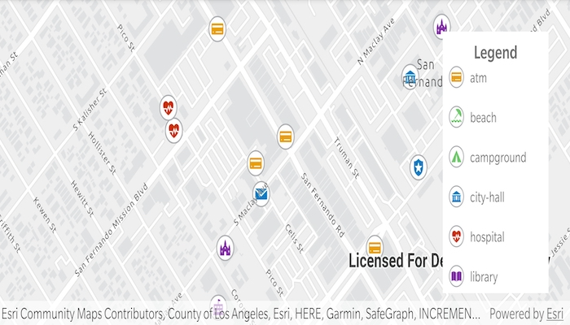

# Create symbol styles from web styles

Create symbol styles from a style file hosted on a portal.

## Use case

Style files hosted on an ArcGIS Online or Enterprise portal are known as web styles. They can be used to style symbols on a feature layer or graphic overlay. Since styles are published from ArcGIS Pro, you can author and design your own beautiful multilayer vector symbols. These vector symbols look good at any resolution and scale well. Runtime users can now access these styles from their native application, and make use of the vector symbols within them to enhance features and graphics in the map.

## How to use the sample

The sample displays a map with a set of symbols that represent the categories of the features within the dataset. Pan and zoom on the map and view the legend to explore the appearance and names of the different symbols from the selected symbol style.

## How it works

1. Create a `FeatureLayer` and add it to the map.
2. Create a `UniqueValueRenderer` and set it to the feature layer.
3. Create a `SymbolStyle` from a portal by passing in the web style name and portal URL.
       * Note: passing `null` as the portal will default to ArcGIS.com.
4. Search for symbols in the symbol style by name using `symbolStyle.getSymbolAsync(symbolName)`.
5. Create a `Symbol` from the search result.
6. Create `UniqueValue` objects for each symbol with defined values to map the symbol to features on the feature layer.
7. Add each `UniqueValue` to the `UniqueValueRenderer`.

## Relevant API

* FeatureLayer
* Symbol
* SymbolStyle
* UniqueValue
* UniqueValueRenderer

## About the data

The sample uses the ['Esri2DPointSymbolsStyle'](https://developers.arcgis.com/javascript/latest/guide/esri-web-style-symbols-2d) Web Style.

The map shows features from the [LA County Points of Interest service](https://services.arcgis.com/V6ZHFr6zdgNZuVG0/arcgis/rest/services/LA_County_Points_of_Interest/FeatureServer/0) hosted on ArcGIS Online.

## Additional information

2D web styles, dictionary web styles, and 3D web styles can all be hosted on an ArcGIS Online or Enterprise portal.

## Tags

renderer, symbol, symbology, web style
