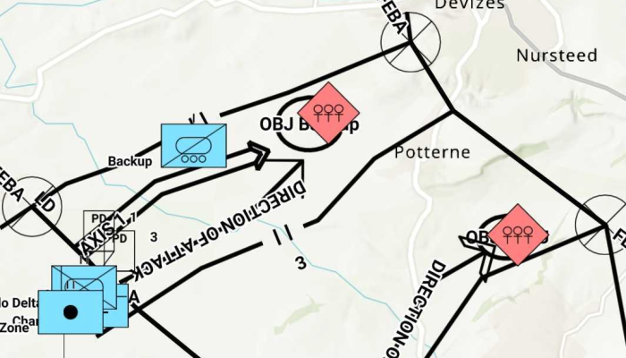

# Dictionary renderer with graphics overlay

Create graphics from an XML file with key-value pairs for each graphic, and display the military symbols using a MIL-STD-2525D web style in 2D.

## Use case

Use a dictionary renderer on a graphics overlay to display more transient data, such as military messages coming through a local tactical network.

## How to use the sample

Run the sample and view the military symbols on the map.

## How it works

1. Create a new `DictionarySymbolStyle(portalItem)` with a portal item containing a MIL-STD-2525D dictionary web style.
2. Create a new `DictionaryRenderer` from the dictionary symbol style.
3. Create a new `GraphicsOverlay`.
4. Set the  dictionary renderer to the graphics overlay.
5. Parse through the local XML file creating a map of key/value pairs for each block of attributes.
6. Create a `Graphic` for each attribute.
7. Use the `_wkid` key to get the geometry's spatial reference.
8. Use the `_control_points` key to get the geometry's shape.
9. Add the graphic to the graphics overlay.

## Relevant API

* DictionaryRenderer
* DictionarySymbolStyle
* GraphicsOverlay

## About the data

The dictionary symbol style in this sample is constructed from a portal item containing a [MIL-STD-2525D symbol dictionary web style](https://arcgis.com/home/item.html?id=d815f3bdf6e6452bb8fd153b654c94ca). This ArcGIS Web Style is used to build custom applications that incorporate the MIL-STD-2525D symbol dictionary. This style supports a configuration for modeling locations as ordered anchor points or full geometries.

## Tags

defense, military, situational awareness, tactical, visualization
