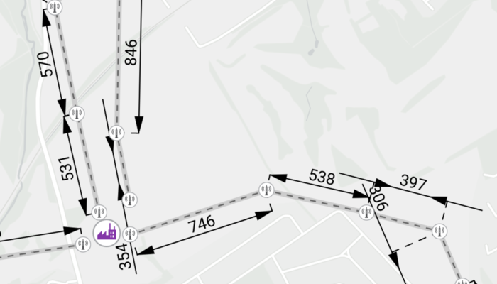

# Display dimensions

Display dimension features from a mobile map package.

## Use case

Dimensions show specific lengths or distances on a map. A dimension may indicate the length of a side of a building or land parcel, or the distance between two features, such as a fire hydrant and the corner of a building.

## How to use the sample

When the sample loads, it will automatically display the map containing dimension features from the mobile map package. The name of the dimension layer containing the dimension features is displayed in the controls box. Control the visibility of the dimension layer with the "Settings" button, and apply a definition expression to show dimensions of greater than or equal to 450m in length using the "Definition Expression" checkbox.

## How it works

1. Create a `MobileMapPackage` specifying the path to the .mmpk file.
2. Load the mobile map package with `mobileMapPackage.loadAsync()`.
3. After it successfully loads, get the first map from the mmpk and set it to the map view: `mapView.map = mobileMapPackage.maps[0]`.
4. Loop through the map's layers to create a `DimensionLayer`.
5. Control the dimension layer's visibility with `dimensionLayer.isVisible` and set a definition expression with `dimensionLayer.definitionExpression`.

## Relevant API

* DimensionLayer
* MobileMapPackage

## Offline data

1. Download the data from [ArcGIS Online](https://arcgis.com/home/item.html?id=f5ff6f5556a945bca87ca513b8729a1e).
2. Open your command prompt and navigate to the folder where you extracted the contents of the data from step 1.
3. Execute the following commands:

`adb push Edinburgh_Pylon_Dimensions.mmpk /Android/data/com.esri.arcgisruntime.sample.displaydimensions/files/Edinburgh_Pylon_Dimensions.mmpk`

Link | Local Location
---------|-------|
|[Edinburgh_Pylon_Dimensions.mmpk](https://arcgis.com/home/item.html?id=f5ff6f5556a945bca87ca513b8729a1e)| /Android/data/com.esri.arcgisruntime.sample.displaydimensions/cache/Edinburgh_Pylon_Dimensions.mmpk |

## About the data

This sample shows a subset of the Edinburgh, Scotland network of pylons, substations, and powerlines within an [Edinburgh Pylon Dimensions mobile map package](https://arcgis.com/home/item.html?id=f5ff6f5556a945bca87ca513b8729a1e), digitized from satellite imagery. Note the data is intended as illustrative of the network only.

## Additional information

Dimension layers can be taken offline from a feature service hosted on ArcGIS Enterprise 10.9 or later, using the [GeodatabaseSyncTask](https://developers.arcgis.com/java/api-reference/reference/com/esri/arcgisruntime/tasks/geodatabase/GeodatabaseSyncTask.html). Dimension layers are also supported in mobile map packages or mobile geodatabases created in ArcGIS Pro 2.9 or later.

## Tags

dimension, layer, mmpk, mobile map package, utility
