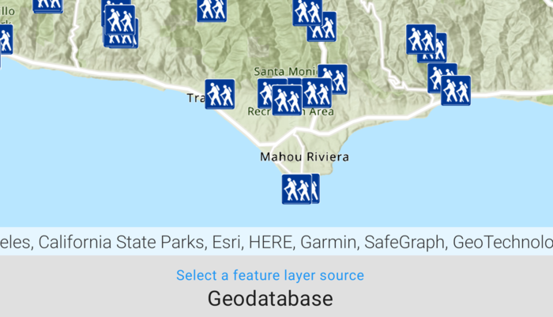

# Display feature layers

Display feature layers from various data sources.

## Use case

Feature layers, like all layers, are visual representations of data and are used on a map or scene. In the case of feature layers, the underlying data is held in a feature table or feature service.

Feature services are useful for sharing vector GIS data with clients so that individual features can be queried, displayed, and edited. There are various online and offline methods to load feature services.

## How to use the sample

Tap the button on the bottom menu to add feature layers, from different sources, to the map. Pan and zoom the map to view the feature layers.

## How it works

1. Set the basemap with a `BasemapStyle`.
2. Load a feature layer with a URL.  
   i. Create a `ServiceFeatureTable` from a URL.  
   ii. Create a `FeatureLayer` with the feature table.
3. Load a feature layer with a portal item.  
   i. Create a `PortalItem` with the portal and item ID.  
   ii. Create a `FeatureLayer` with the portal item and with or without the layer ID.
4. Load a feature layer with a geodatabase.  
   i. Instantiate and load a `Geodatabase` using the file name.  
   ii. Get the feature table from the geodatabase with the feature table's name.  
   iii. Create a `FeatureLayer` from the feature table.
5. Load a feature layer with a geopackage.  
   i. Instantiate and load a geopackage using its file name.  
   ii. Get the first `GeoPackageFeatureTable` from the `GeoPackage.geoPackageFeatureTables` array.  
   iii. Create an `FeatureLayer` from the feature table.
6. Load a feature layer with a shapefile.  
   i. Create a `ShapefileFeatureTable` using the shapefile name.  
   ii. Create a `FeatureLayer` from the feature table and load it.
7. Add the feature layer to the map's `OperationalLayers`.

## Relevant API

* FeatureLayer
* Geodatabase
* GeoPackageFeatureTable
* PortalItem
* ServiceFeatureTable
* ShapefileFeatureTable

## Offline data

1. Download the data from ArcGIS Online.
    - [LA trails geodatabase](https://www.arcgis.com/home/item.html?id=2b0f9e17105847809dfeb04e3cad69e0)
    - [Aurora Colorado geopackage](https://www.arcgis.com/home/item.html?id=68ec42517cdd439e81b036210483e8e7)
    - [Scottish Wildlife Trust reserve shapefile](https://www.arcgis.com/home/item.html?id=15a7cbd3af1e47cfa5d2c6b93dc44fc2)
2. Extract the contents of the downloaded zip file to disk.
3. Open your command prompt and navigate to the folder where you extracted the contents of the data from step 1.
4. Load the downloaded files using `adb push` to the app. 
    - `adb push LA_Trails.geodatabase /Android/data/com.esri.arcgisruntime.sample.displayfeaturelayers/files/LA_Trails.geodatabase`
    - `adb push AuroraCO.gpkg /Android/data/com.esri.arcgisruntime.sample.displayfeaturelayers/files/AuroraCO.gpkg`
    - `adb push ScottishWildlifeTrust_reserves/ /Android/data/com.esri.arcgisruntime.sample.displayfeaturelayers/files/ScottishWildlifeTrust_reserves/`

Link | Local Location
---------|-------|
|[LA trails geodatabase](https://www.arcgis.com/home/item.html?id=2b0f9e17105847809dfeb04e3cad69e0)| /Android/data/com.esri.arcgisruntime.sample.displayfeaturelayers/files/LA_Trails.geodatabase |
|[Aurora Colorado geopackage](https://www.arcgis.com/home/item.html?id=68ec42517cdd439e81b036210483e8e7)| /Android/data/com.esri.arcgisruntime.sample.displayfeaturelayers/files/AuroraCO.gpkg |
|[Scottish Wildlife Trust reserve shapefile](https://www.arcgis.com/home/item.html?id=15a7cbd3af1e47cfa5d2c6b93dc44fc2)| /Android/data/com.esri.arcgisruntime.sample.displayfeaturelayers/files/ScottishWildlifeTrust_reserves/ |

## About the data

This sample uses the [Naperville damage assessment service](https://sampleserver7.arcgisonline.com/server/rest/services/DamageAssessment/FeatureServer/0), [Trees of Portland portal item](https://www.arcgis.com/home/item.html?id=1759fd3e8a324358a0c58d9a687a8578), [Los Angeles Trailheads geodatabase](https://www.arcgis.com/home/item.html?id=2b0f9e17105847809dfeb04e3cad69e0), [Aurora, Colorado GeoPackage](https://www.arcgis.com/home/item.html?id=68ec42517cdd439e81b036210483e8e7), and [Scottish Wildlife Trust Reserves Shapefile](https://www.arcgis.com/home/item.html?id=15a7cbd3af1e47cfa5d2c6b93dc44fc2).

The Scottish Wildlife Trust shapefile data is provided from Scottish Wildlife Trust under [CC-BY licence](https://creativecommons.org/licenses/by/4.0/). Data Copyright Scottish Wildlife Trust (2022).

## Tags

feature, geodatabase, geopackage, layers, service, shapefile, table
