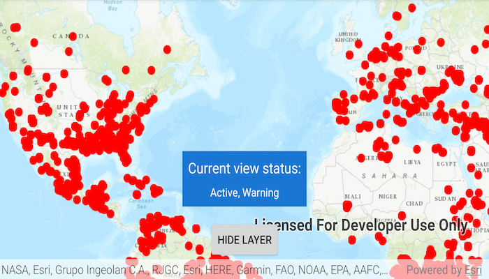

# Display layer view status

Determine if a layer is currently being viewed.

## Use case

The view status includes information on the loading state of layers and whether layers are visible at a given scale. You might change how a layer is displayed in a layer list to communicate whether it is being viewed in the map. For example, you could show a loading spinner next to its name when the view status is LOADING, grey out the name when NOT_VISIBLE or OUT_OF_SCALE, show the name normally when ACTIVE, or with a warning or error icon when the status is WARNING or ERROR.

## How to use the sample

Tap the *Load* button to create a new layer and add it to the map. As you pan and zoom around the map, note how the `LayerViewStatus` flags change; for example, `OUT_OF_SCALE` becomes true when the map is scaled outside of the layer's min and max scale range.

## How it works

1. Create an `ArcGISMap` with some operational layers.
2. Set the map on a `MapView`.
3. Listen to `LayerViewStateChangedEvents` from the map view.
4. Get the `Layer` for the event with `event.getLayer()` and the current view status with `event.getLayerViewStatus()`.

## Relevant API

* ArcGISMap
* LayerViewStateChangedEvent
* LayerViewStateChangedListener
* MapView

## About the data

The map shows a tiled layer of world time zones, a map image layer of the census, and a feature layer of recreation services.

## Additional information

The following are members of the `LayerViewStatus` enum:

* `ACTIVE`: The layer in the view is active.
* `NOT_VISIBLE`: The layer in the view is not visible.
* `OUT_OF_SCALE`: The layer in the view is out of scale. A status of `OUT_OF_SCALE` indicates that the view is zoomed outside of the scale range of the layer. If the view is zoomed too far in (e.g. to a street level), it is beyond the max scale defined for the layer. If the view has zoomed too far out (e.g. to global scale), it is beyond the min scale defined for the layer.
* `LOADING`: The layer in the view is loading. Once loading has completed, the layer will be available for display in the view. If there was a problem loading the layer, the status will be set to ERROR.
* `ERROR`: The layer in the view has an unrecoverable error. When the status is `ERROR`, the layer cannot be rendered in the view. For example, it may have failed to load, be an unsupported layer type, or contain invalid data.
* `WARNING`: The layer in the view has a non-breaking problem with its display, such as incomplete information or a network request failure.

If your device supports airplane mode, you can toggle this on and pan around the map to see layers display the WARNING status when they cannot online fetch data. Toggle airplane mode back off to see the warning disappear.

## Tags

layer, load, map, status, view, visibility
