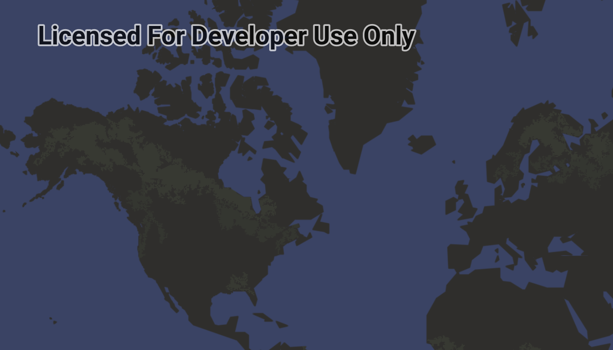

# Display map

Display a map with an imagery basemap.

## Use case

The map is the fundamental building block of any GIS application and is used to specify how geographic data is organized and communicated to your users.

## How to use the sample

Run the sample to view the map. Pan and zoom to navigate the map.

## How it works

1. Create an `ArcGISMap` with a topographic basemap and an initial viewpoint.
2. Set the map to the map view with `mapView.map = map`.

## Relevant API

* ArcGISMap
* Basemap
* MapView

## Tags

basemap, map
