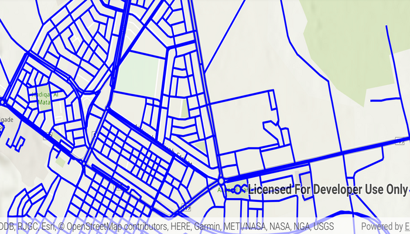

# Display OGC API collection

Display an OGC API feature collection and query features while navigating the map view.

## Use case

When panning the map view, it may be necessary to query the OGC API feature table for additional features within the new visible extent.

## How to use the sample

Pan the map and observe how new features are loaded from the OGC API feature service.

## How it works

1. Create an `OgcFeatureCollectionTable` using a URL to an OGC API feature service and a collection ID.
2. Set the feature table's `FeatureRequestMode` property to `FeatureRequestMode.MANUAL_CACHE`.
3. Call `OgcFeatureCollectionTable.loadAsync()`.
4. Create a `FeatureLayer` using the feature collection table and add it to the map view.
5. Every time the map view navigation completes:
    1. Create `QueryParameters`.
    2. Set the parameter's `Geometry` to the current extent of the map view.
    3. Set the parameter's `SpatialRelationship` property to `SpatialRelationship.INTERSECTS`.
    4. Set the `MaxFeatures` property to 5000 (some services have a low default value for maximum features).
    5. Call `OgcFeatureCollectionTable.populateFromServiceAsync()` using the query parameters from the previous steps.

## Relevant API

* OgcFeatureCollectionTable
* QueryParameters

## About the data

The [Daraa, Syria test data](https://services.interactive-instruments.de/t15/daraa) is OpenStreetMap data converted to the Topographic Data Store schema of NGA.

## Additional information

See the [OGC API website](https://ogcapi.ogc.org/) for more information on the OGC API family of standards.

## Tags

feature, feature layer, feature table, OGC, OGC API, service, table, web
