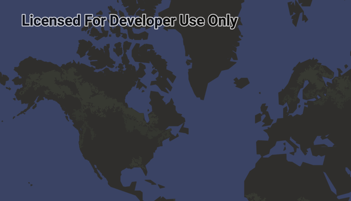

# Display test map

Display a map with an imagery basemap.

## Use case

The map is the fundamental building block of any GIS application and is used to specify how geographic data is organized and communicated to your users.

## How to use the sample

Run the sample to view the map. Pan and zoom to navigate the map.

## How it works

1. Create an `ArcGISMap` with a topographic basemap and an initial viewpoint.
2. Set the map to the map view with `mapView.map = map`.

## Relevant API

* ArcGISMap
* BasemapStyle
* MapView

## Offline data

1. Download the data from [ArcGIS Online](https://www.arcgis.com/home/item.html?id=e1f3a7254cb845b09450f54937c16061).
2. Open your command prompt and navigate to the folder where you extracted the contents of the data from step 1.
3. Push the data into the scoped storage of the sample app:

`adb push Yellowstone.mmpk /Android/data/com.esri.arcgisruntime.sample.openmobilemappackage/files/Yellowstone.mmpk`

## Tags

basemap, map
