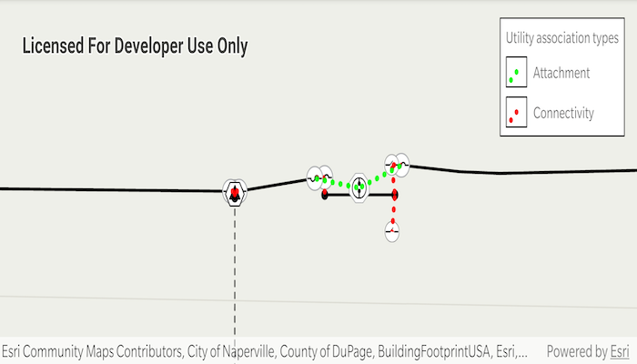

# Display utility associations

Create graphics for utility associations in a utility network.

## Use case

Visualizing utility associations can help you to better understand trace results and the topology of your utility network. For example, connectivity associations allow you to model connectivity between two junctions that don't have geometric coincidence (are not in the same location); structural attachment associations allow you to model equipment that may be attached to structures; and containment associations allow you to model features contained within other features.

## How to use the sample

Pan and zoom around the map. Observe graphics that show utility associations between junctions.

## How it works

1. Create and load a `UtilityNetwork` with a feature service URL.
2. Add a `FeatureLayer` to the map for every `UtilityNetworkSource` of type `EDGE` or `JUNCTION`.
3. Create a `GraphicsOverlay` for the utility associations.
4. Add a `NavigationChangedListener` to listen for `NavigationChangedEvent`s.
5. When the sample starts and every time the viewpoint changes:
    * Get the geometry of the map view's extent.
    * Get the associations that are within the current extent using `getAssociationsAsync(extent)`.
    * Get the `UtilityAssociationType` for each association.
    * Create a `Graphic` using the `Geometry` property of the association and a preferred symbol.
    * Add the graphic to the graphics overlay.

## Relevant API

* GraphicsOverlay
* UtilityAssociation
* UtilityAssociationType
* UtilityNetwork

## About the data

The [Naperville electrical](https://sampleserver7.arcgisonline.com/server/rest/services/UtilityNetwork/NapervilleElectric/FeatureServer) feature service in this sample represents an electric network in Naperville, Illinois, which contains a utility network used to run the subnetwork-based trace.

Using utility network on ArcGIS Enterprise 10.8 requires an ArcGIS Enterprise member account licensed with the [Utility Network user type extension](https://enterprise.arcgis.com/en/portal/latest/administer/windows/license-user-type-extensions.htm#ESRI_SECTION1_41D78AD9691B42E0A8C227C113C0C0BF). Please refer to the [utility network services documentation](https://enterprise.arcgis.com/en/server/latest/publish-services/windows/utility-network-services.htm).

## Tags

associating, association, attachment, connectivity, containment, relationships
