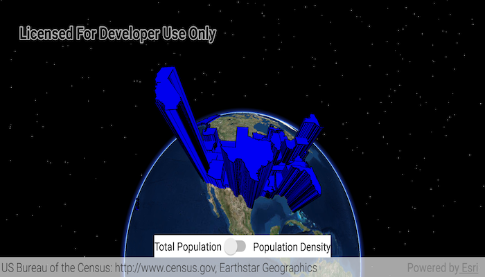

# Feature Layer Extrusion

This sample demonstrates how to apply extrusion to a renderer on a feature layer.

## Features

* ExtrusionMode
* FeatureLayer
* Renderer
* SceneProperties

## Developer Pattern

1. Create a `ServiceFeatureTable` from a web service.
1. Set the `ServiceFeatureTable` to a `FeatureLayer` and set the `renderingMode` to `FeatureLayer.RenderingMode.DYNAMIC`.
1. When definining the `FeatureLayer`'s `Renderer`, remember to set `.ExtrusionMode` on the `Renderer.sceneProperties`.
1. Finally, also on `SceneProperties`, set `.extrusionExpression = "[SOME_FIELD]"` to a `Field` from the `ServiceFeatureTable`.
