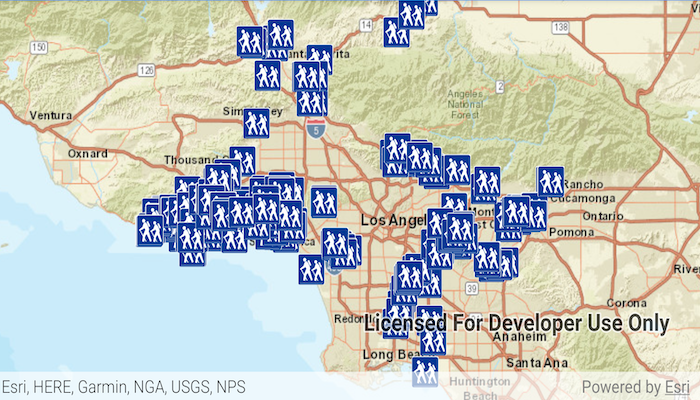

# Feature layer (geodatabase)

Display features from a local geodatabase.

## Use case

Accessing data from a local geodatabase is useful when working in an environment that has an inconsistent internet connection or that does not have an internet connection at all. For example, a department of transportation field worker might source map data from a local geodatabase when conducting signage inspections in rural areas with poor network coverage.

## How to use the sample

Pan and zoom around the map. View the data loaded from the geodatabase.

## How it works

1. Create a geodatabase using the provided local resource, `Geodatabase(geodatabaseResourcePath)`.
2. Wait for geodatabase to load by adding a listener with `Geodatabase.addDoneLoadingListener()`.
3. Get the 'Trailheads' `GeodatabaseFeatureTable` from the geodatabase, `Geodatabase.getGeodatabaseFeatureTable("Trailheads")`.
4. Create feature layer using the table from above, `FeatureLayer(geodatabaseFeatureTable)`.
5. Add feature layer to `ArcGISMap` with `ArcGISMap.operationalLayers.add(featureLayer)`.

## Relevant API

* FeatureLayer
* Geodatabase
* GeodatabaseFeatureTable

## Offline Data

1. Download the data from [ArcGIS Online](https://www.arcgis.com/home/item.html?id=2b0f9e17105847809dfeb04e3cad69e0).
2. Extract the contents of the downloaded zip file to disk.
3. Open your command prompt and navigate to the folder where you extracted the contents of the data from step 1.
4. Push the data into the scoped storage of the sample app:
`adb push LA_Trails.geodatabase /Android/data/com.esri.arcgisruntime.sample.featurelayergeodatabase/files/LA_Trails.geodatabase`

## About the data

The sample shows trailheads in the greater Los Angeles area displayed on top of a Streets basemap.

## Additional information

One of the ArcGIS Runtime data set types that can be accessed via the local storage of the device (i.e. hard drive, flash drive, micro SD card, USB stick, etc.) is a mobile geodatabase. A mobile geodatabase can be provisioned for use in an ArcGIS Runtime application by ArcMap. The following provide some helpful tips on how to create a mobile geodatabase file:

In ArcMap, choose File > Share As > ArcGIS Runtime Content from the menu items to create the .geodatabase file (see the document: http://desktop.arcgis.com/en/arcmap/latest/map/working-with-arcmap/creating-arcgis-runtime-content.htm).

Note: You could also use the 'Services Pattern' and access the Geodatabase class via a Feature Service served up via ArcGIS Online or ArcGIS Enterprise. Instead of using the Geodatabase class to access the .geodatabase file on disk, you would use GeodatabaseSyncTask point to a Uri instead.

## Tags

geodatabase, mobile, offline
