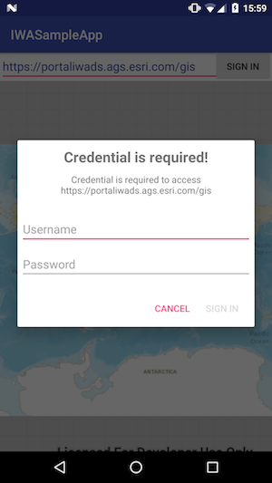

This sample app shows how to use a custom authentication challenge handler to work with IWA portals. 

 1. Enter url of the portal you want to connect in the edit text box. The url of a default test portal has
 been set to the box.
 2. Tap on the "Sing In" button to connect to the portal as a named user. A dialog will be popped up for
 username/password. When a correct credential is passed, portal will be loaded. If you keep passing in
 wrong credential, no more prompt for credential after 5 attempts, which is actually 4 times due to a known
 issue in our SDK. Then portal will fail to load. You can click the "Cancel" button to cancel the sign-in
 process. Portal will be failed to load with different error message.

