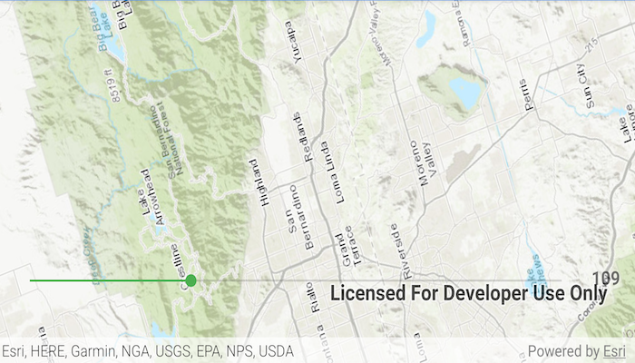

# Map rotation

Rotate a map.

## Use case

A user may wish to view the map in an orientation other than north-facing.

## How to use the sample

Use the progress bar to rotate the map. If the map is not pointed north, the progress bar will show the heading relative to north in degrees. Slide the progress bar to zero to set the maps's heading back to north.

## How it works

1. Instantiate an `ArcGISMap` object.
2. Set the map to a `MapView` object.
3. Use `setViewpointRotationAsync(...)` to set the rotation angle.

## Relevant API

* ArcGISMap
* MapView

## Tags

rotate, rotation, viewpoint
