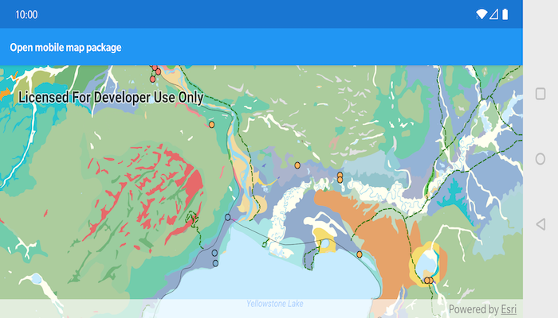

# Open mobile map package

Display a map from a mobile map package.

## Use case

An .mmpk file is an archive containing the data (specifically, basemaps and features) used to display an offline map.
A mobile map package may need to be unpacked to a directory to allow read support for certain data types.

## How to use the sample

When the sample opens, it will automatically display the map in the mobile map package. Pan and zoom to observe the data from the mobile map package.

## How it works

1. Create a `MobileMapPackage` specifying the path to the .mmpk file.
2. Load the mobile map package with mmpk.loadAsync().
3. After it successfully loads, get the map from the .mmpk and add it to the map view: `mapView.setMap(mmpk.getMaps().get(0))`.

## Relevant API

* MapView
* MobileMapPackage

## About the data

This mobile map package shows points of interest within Yellowstone National Park. It is available for download [here on ArcGIS Online](https://arcgisruntime.maps.arcgis.com/home/item.html?id=e1f3a7254cb845b09450f54937c16061).

## Offline Data

1. Download the data from [ArcGIS Online](https://www.arcgis.com/home/item.html?id=e1f3a7254cb845b09450f54937c16061).
2. Open your command prompt and navigate to the folder where you extracted the contents of the data from step 1.
3. Push the data into the scoped storage of the sample app:
`adb push Yellowstone.mmpk /Android/data/com.esri.arcgisruntime.sample.openmobilemappackage/files/Yellowstone.mmpk`

## Tags

mobile map package, mmpk, offline

