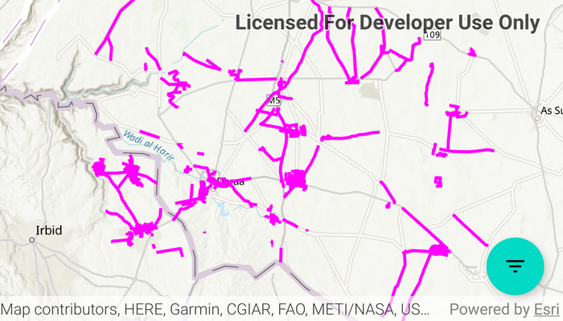

# Query with CQL filters

Query data from an OGC API feature service using CQL filters.

## Use case

CQL (Common Query Language) is an OGC-created query language used to query for subsets of features. Use CQL filters to narrow geometry results from an OGC feature table.

## How to use the sample

The sample loads displaying all features within the OGC API feature service. Select a sample CQL query from the drop down menu. Optionally, adjust the max features value in the text box, and toggle the time extent check box to query the data with a time extent. Press the "Apply query" button to see the query applied to the OGC API features shown on the map.

## How it works

1. Create an `OgcFeatureCollectionTable` object using a URL to an OGC API feature service and a collection ID.
2. Create `QueryParameters` and set a CQL filter string to it using `queryParameters.setWhereClause()`.
3. Set the maximum amount of features to be returned with `queryParamters.setMaxFeatures()`.
4. Create a new `TimeExtent` from start and end date values, and set it to the `queryParameters.setTimeExtent()` method.
5. Populate the OGC feature collection table using `.populateFromServiceAsync()` with the custom `QueryParameters` created in the previous steps.
6. Use `mapView.setViewpointGeometryAsync()` with the OGC feature collection table extent to view the newly-queried features.

## Relevant API

* OgcFeatureCollectionTable
* QueryParameters
* TimeExtent

## About the data

The [Daraa, Syria test data](https://demo.ldproxy.net/daraa) is OpenStreetMap data converted to the Topographic Data Store schema of NGA.

## Additional information

See the [OGC API website](https://ogcapi.ogc.org/) for more information on the OGC API family of standards. See the [CQL documentation](https://portal.ogc.org/files/96288#cql-core) to learn more about the common query language.

## Tags

browse, catalog, common query language, CQL, feature table, filter, OGC, OGC API, query, service, web
