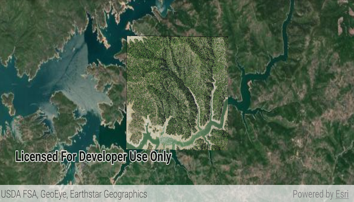

# Raster layer (file)

Create and use a raster layer made from a local raster file.

## Use case

Rasters can be digital aerial photographs, imagery from satellites, digital pictures, or even scanned maps. An end-user will frequently need to import raster files acquired through various data-collection methods into their map to view and analyze the data.

## How to use the sample

When the sample starts, a raster will be loaded from a file and displayed in the map view.

## How it works

1. Create a `Raster` from a raster file.
1. Create a `RasterLayer` from the raster.
1. Add it as an operational layer with `map.operationalLayers.add(rasterLayer)`.

## Relevant API

* Raster
* RasterLayer

## Additional information

See the topic [What is raster data?](http://desktop.arcgis.com/en/arcmap/10.3/manage-data/raster-and-images/what-is-raster-data.htm) in the *ArcMap* documentation for more information about raster images.

## Offline Data

1. Download the data from [ArcGIS Online](https://arcgisruntime.maps.arcgis.com/home/item.html?id=7c4c679ab06a4df19dc497f577f111bd).
2. Extract the contents of the downloaded zip file to disk.
3. Open your command prompt and navigate to the folder where you extracted the contents of the data from step 1.
4. Push the data into the scoped storage of the sample app:
`adb push raster-file /Android/data/com.esri.arcgisruntime.sample.rasterlayerfile/files/raster-file`
5. 
## Tags

data, image, import, layer, raster, visualization
