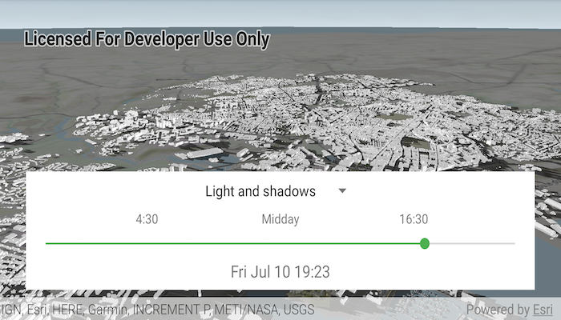

# Realistic lighting and shadows

Show realistic lighting and shadows for a given time of day.

## Use case

You can use realistic lighting to evaluate the shadow impact of buildings and utility infrastructure on the surrounding community. This could be useful for civil engineers and urban planners, or for events management assessing the impact of building shadows during an outdoor event.

## How to use the sample

Tap the floating action button to select lighting options. Select one of the three lighting options via the spinner to show that lighting effect on the SceneView. Select a time of day from the slider (based on a 24hr clock) to show the lighting for that time of day in the SceneView.

## How it works

1. Create an `ArcGISScene` and display it in a `SceneView`.
2. Create a `Calendar` to define the time of day.
3. Set the sun time to that calendar with `sceneView.sunTime = calendar`.
4. Set the lighting mode of the SceneView to `NO_LIGHT`, `LIGHT`, or `LIGHT_AND_SHADOWS` with `sceneView.sunLighting = LightingMode`.

## Relevant API

* ArcGISScene
* LightingMode
* SceneView.sunLighting
* SceneView.sunTime

## Tags

3D, lighting, realism, realistic, rendering, shadows, sun, time
