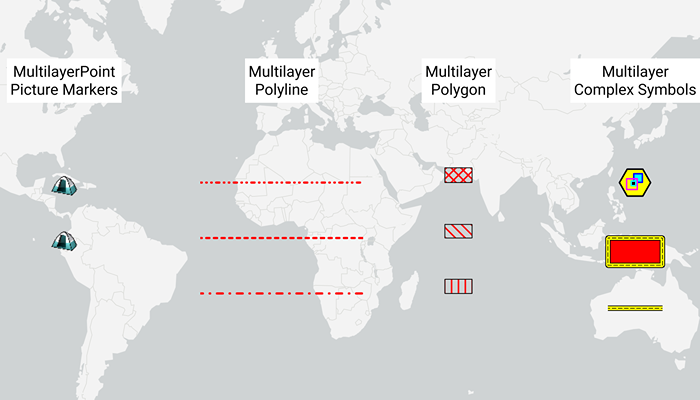

# Render multilayer symbols

Show different kinds of multilayer symbols on a map.

## Use case

Allows you to customize a graphic with a multilayer symbol. For example, you may want more customizable symbols than those that are provided with the API to display a unique representation of a landmark.

## How to use the sample

The sample loads with multilayer symbols displayed for points, polylines, and polygons.

## How it works

1. Create multilayer symbols for each predefined 2D simple symbol style.
    * For multilayer point symbols, use the `MultilayerPointSymbol` constructor.
    * For multilayer polyline symbols, use the `MultilayerPolylineSymbol` constructor.
    * For multilayer polygon symbols, use the `MultilayerPolygonSymbol` constructor.
2. Create `Graphic`s by passing in a `Geometry` and the associated multilayer symbol.
3. Add graphics to the graphics overlay with `graphicsOverlay.getGraphics.add(graphic)`

## Relevant API

* Graphic
* GraphicsOverlay
* MultilayerPointSymbol
* MultilayerPolygonSymbol
* MultilayerPolylineSymbol
* PictureMarkerSymbolLayer
* SolidFillSymbolLayer
* SolidStrokeSymbolLayer
* VectorMarkerSymbolLayer

## Tags

graphic, marker, multilayer, picture, symbol
