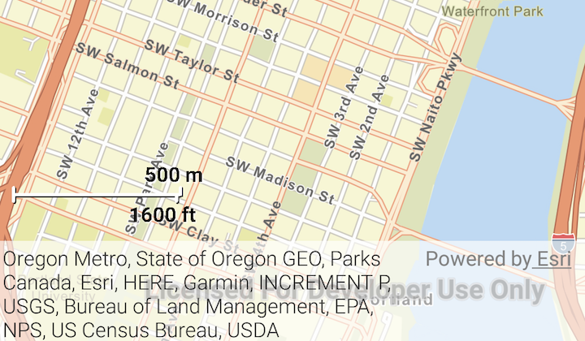

# Scalebar
This sample creates a scalebar to display the representation of an accurate linear measurement on the map.



## Features
* Basemap
* ArcGISMap
* Scalebar
* WmtsLayer

## Developer Pattern
The simplest pattern is to just instantiate a `Scalebar` and call `addToMapView(mapView)` to display it within the `MapView`. This causes default settings to be used.  

```kotlin
// add a dual unit line scalebar to MapView
val scaleBar = Scalebar(this)
with (scaleBar) {
    alignment = Scalebar.Alignment.LEFT
    style = Scalebar.Style.DUAL_UNIT_LINE
    addToMapView(mapView)
}
```
