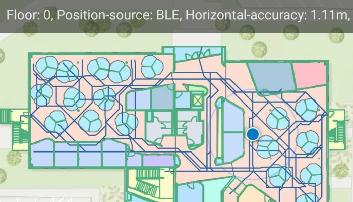

# Show device location using indoor positioning

Show your device's real-time location while inside a building by using signals from indoor positioning beacons.

## Use case

An indoor positioning system (IPS) allows you to locate yourself and others inside a building in real time. Similar to GPS, it puts a blue dot on indoor maps and can be used with other location services to help navigate to any point of interest or destination, as well as provide an easy way to identify and collect geospatial information at their location.

## How to use the sample

When the device is within range of an IPS beacon, toggle "Show Location" to change the visibility of the location indicator in the map view. The system will ask for permission to use the device's location if the user has not yet used location services in this app. It will then start the location display with auto-pan mode set to `navigation`.

When there is no IPS beacons nearby, or other errors occur while initializing the indoors location data source, it will seamlessly fall back to the current device location as determined by GPS.

## How it works

1. Load an IPS-enabled map. This can be a web map hosted as a portal item in ArcGIS Online, an Enterprise Portal, or a mobile map package (.mmpk) created with ArcGIS Pro.
2. Create an `IndoorsLocationDataSource` with the positioning feature table (stored with the map) and the pathways feature table after both tables are loaded.
3. Handle location change events to respond to floor changes or read other metadata for locations.
4. Assign the `IndoorsLocationDataSource` to the map view's location display.
5. Enable and disable the map view's location display using `LocationDisplay.start()` and `LocationDisplay.stop()`. Device location will appear on the display as a blue dot and update as the user moves throughout the space.
6. Use the `LocationDisplay.AutoPanMode` property to change how the map behaves when location updates are received.

## Relevant API

* FeatureTable
* IndoorsLocationDataSource
* LocationDataSource
* LocationDisplay
* FeatureLayer
* ArcGISMap
* MapView

## About the data

This sample uses an [IPS-enabled web map](https://viennardc.maps.arcgis.com/home/item.html?id=89f88764c29b48218366855d7717d266) that displays Building L on the Esri Redlands campus. Please note: you would only be able to use the indoor positioning functionalities when you are inside this building. Swap the web map to test with your own IPS setup.

## Additional information

* Location and Bluetooth permissions are required for this sample.
* To learn more about IPS, read the [Indoor positioning](https://developers.arcgis.com/ios/device-location/indoor-positioning/) article on ArcGIS Developer website.
* To learn more about how to deploy the indoor positioning system, read the [Deploy ArcGIS IPS](https://doc.arcgis.com/en/ips/latest/get-started/introduction-to-the-deployment-of-arcgis-ips.htm) article.

## Tags

beacon, BLE, blue dot, Bluetooth, building, facility, GPS, indoor, IPS, location, map, mobile, navigation, site, transmitter
