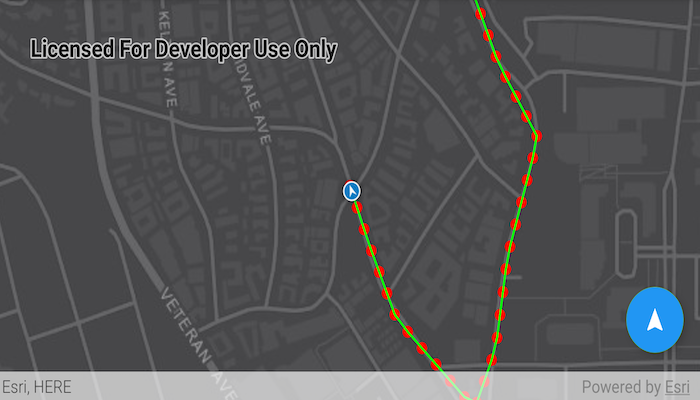

# Show location history

Display your location history on the map.

## Use case

You can track device location history and display it as lines and points on the map. The history can be used to visualize how the user moved through the world, to retrace their steps, or to create new feature geometry. An unmapped trail, for example, could be added to the map using this technique.

## How to use the sample

Tap the floating action button to start tracking your location, which will appear as points on the map. A line will connect the points for easier visualization. Tap the button again to stop updating the location history. This sample uses a simulated data source to allow the sample to be useful on desktop/non-mobile devices. To track a user's real position, use the `DefaultLocationDataSource` instead.

## How it works

1. Request location permission from the Android operating system.
2. Create a graphics overlay to show each point and another graphics overlay to display the route polyline.
3. Create a `SimulatedLocationDataSource` and initialize it with a polyline. Start the `SimulatedLocationDataSource` to begin receiving location updates.
4. Use a `LocationChangedListener` on the `simulatedLocationDataSource` to get location updates. 
5. On location updates, store that location, display the location as a point on the map, and recreate the route polyline.

## Relevant API

* AndroidLocationDataSource
* Location.position
* LocationDataSource
* LocationDataSource.Location
* LocationDataSource.LocationChangedEvent
* LocationDataSource.LocationChangedListener
* LocationDisplay.AutoPanMode
* LocationDisplay.LocationDataSource
* MapView.LocationDisplay
* SimulatedLocationDataSource

## About the data

A custom set of points is used to create a `Polyline` and initialize a `SimulatedLocationDataSource`. This simulated location data source enables easier testing and allows the sample to be used on devices without an actively updating GPS signal.

## Tags

bread crumb, breadcrumb, GPS, history, movement, navigation, real-time, trace, track, trail
