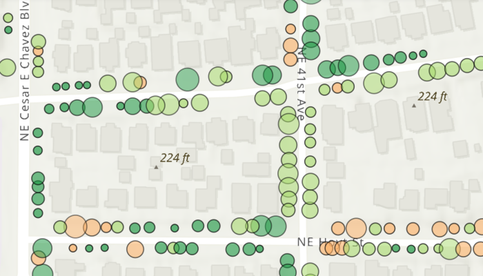

# Toggle between feature request modes

Use different feature request modes to populate the map from a service feature table.

## Use case

Feature tables can be initialized with a feature request mode which controls how frequently features are requested and locally cached in response to panning, zooming, selecting, or querying. The feature request mode affects performance and should be chosen based on considerations such as how often the data is expected to change or how often changes in the data should be reflected to the user.

* `ON_INTERACTION_CACHE` - fetches features within the current extent when needed (after a pan or zoom action) from the server and caches those features in a table on the client. Queries will be performed locally if the features are present, otherwise they will be requested from the server. This mode minimizes requests to the server and is useful for large batches of features which will change infrequently.

* `ON_INTERACTION_NO_CACHE` - always fetches features from the server and doesn't cache any features on the client. This mode is best for features that may change often on the server or whose changes need to always be visible.

    > **NOTE**: **No cache** does not guarantee that features won't be cached locally. Feature request mode is a performance concept unrelated to data security.

* `MANUAL_CACHE` - only fetches features when explicitly populated from a query. This mode is best for features that change minimally or when it is not critical for the user to see the latest changes.

## How to use the sample

Choose a request mode by clicking on a radio button. Pan and zoom to see how the features update at different scales. If you choose "Manual cache", click the "Populate" button to manually get a cache with a subset of features.

Note: The service limits requests to 2000 features.

## How it works

1. Create a `ServiceFeatureTable` with a feature service URL.
2. Set the `FeatureRequestMode` property of the service feature table to the desired mode (`ON_INTERACTION_CACHE`, `ON_INTERACTION_NO_CACHE`, or `MANUAL_CACHE`).
    * If using `MANUAL_CACHE`, populate the features with `ServiceFeatureTable.populateFromServiceAsync()`.
3. Create a `FeatureLayer` with the feature table and add it to an `ArcGISMap`'s operational layers to display it.

## Relevant API

* FeatureLayer
* ServiceFeatureTable
* ServiceFeatureTable.FeatureRequestMode

## About the data

This sample uses the [Trees of Portland](https://services2.arcgis.com/ZQgQTuoyBrtmoGdP/arcgis/rest/services/Trees_of_Portland/FeatureServer/0) service showcasing over 200,000 street trees in Portland, OR. Each tree point models the health of the tree (green - better, red - worse) as well as the diameter of its trunk.

## Tags

cache, data, feature, feature request mode, performance
