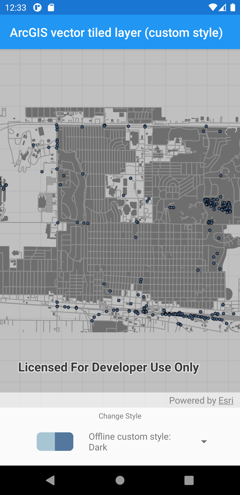

# ArcGIS vector tiled layer (custom style)

Load ArcGIS vector tiled layers using custom styles.

## Use case

Vector tile basemaps can be created in ArcGIS Pro and published as offline packages or online services. You can create a custom style tailored to your needs and easily apply them to your map. `ArcGISVectorTiledLayer` has many advantages over traditional raster based basemaps (`ArcGISTiledLayer`), including smooth scaling between different screen DPIs, smaller package sizes, and the ability to rotate symbols and labels dynamically.

## How to use the sample

Pan and zoom to explore the vector tile basemap.

## How it works

1. Construct an `ArcGISVectorTiledLayer` with the URL of a custom style from AGOL.
    * Follow these steps to create a vector tiled layer with a custom style from offline resources:  
    i. Construct an `VectorTileCache` using the name of the local vector tile package.  
    ii. Create an `PortalItem` using the URL of a custom style.  
    iii. Create an `ExportVectorTilesTask` using the portal item.  
    iv. Get the `ExportVectorTilesJob` using `ExportVectorTilesTask.exportStyleResourceCache(downloadDirectory)`.  
    v. Start the job using  `ExportVectorTilesJob.start()`.  
    vi. Once the job is complete, construct an `ArcGISVectorTiledLayer` using the vector tile cache and the `ItemResourceCache` from the job's result.  
2. Create an `Basemap` from the `ArcGISVectorTiledLayer`.
3. Assign the `Basemap` to the map's `basemap`.

## Relevant API

* ArcGISVectorTiledLayer
* ExportVectorTilesTask
* ItemResourceCache
* Map
* VectorTileCache

## Tags

tiles, vector, vector basemap, vector tiled layer, vector tiles
