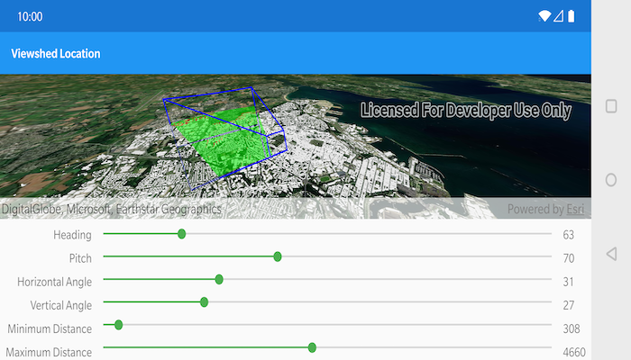

# Viewshed Location
A viewshed shows the visible and obstructed areas from an observer's vantage point. This sample demonstrates all of the configurable properties of a viewshed.

## How to use the sample
Use the seek bars on the bottom of the screen to change the properties of the viewshed and see them updated in real time. To move the viewshed, double touch and drag your finger across the screen. Lift your finger to stop moving the viewshed.

## How it works
1. Create a `LocationViewshed` passing in the observer location, heading, pitch, horizontal/vertical angles, and min/max distances.
1. Set the property values on the viewshed instance for location, direction, range, and visibility properties. 
1. Properties like `.setFrustumOutlineColor(<color>)` are set statically on `Viewshed`.

## Relevant API
* AnalysisOverlay
* ArcGISTiledElevationSource
* ArcGISSceneLayer
* LocationViewshed
* Viewshed

#### Tags
Analysis