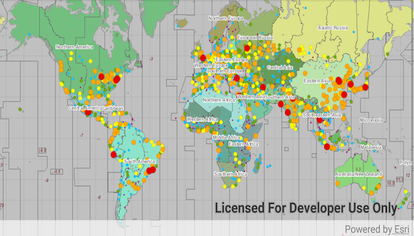

# WMTS layer

Display a layer from a Web Map Tile Service.

## Use case

WMTS services can have several layers. You can use Runtime to explore the layers available from a service. This would commonly be used to enable a browsing experience where users can choose which layers they want to display at run time.

## How to use the sample

The layer will be displayed automatically. Pan and zoom to explore the layer.

## How it works

To display a WMTS layer directly from a URL:

1. Create a `WmtsService` object using the URL of the WMTS service.
2. Create a `WmtsLayer` object with the ID of the layer to display.

To explore layers from a WMTS service:

1. Create a `WmtsService` object using the URL of the WMTS service.
2. After loading the WMTS service, get the list of `WmtsLayerInfo` objects from the service info of the WMTS service with `wmtsServiceInfo.layerInfos`.
3. Use one of the layer infos to create the WMTS layer with `WmtsLayer(layerInfos[0])`.
4. Create a basemap with the WMTS layer and set it to the map with `map.basemap = Basemap(wmtsLayer)`.

## Relevant API

* WmtsLayer
* WmtsLayerInfo
* WmtsService
* WmtsServiceInfo

## About the data

The map visualizes world time zones.

## Tags

layer, OGC, raster, tiled, web map tile service
