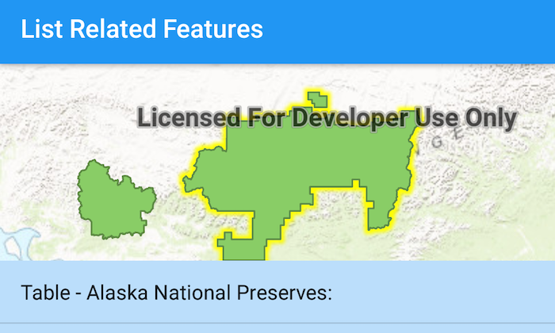

# List Related Features



The List Related Features app has a `MapView` preloaded with a web map `FeatureLayer`. When you tap on a `Feature` you get a returned list of related features in an Android `BottomSheet`. The `FeatureLayer` has more than one relationship, the `ListView` results for each relationship.

## Features
* ArcGISFeature
* ArcGISFeatureTable
* RelatedQueryParameters
* RelationshipInfo

## Developer Pattern
The `FeatureTable` from a selected `Feature` is used as parameters on a `FeatureTable.queryRelatedFeaturesAsync` method.  The results returned represent related `Feature`s of which you can obtain the attribute values which are displayed.

```java
ArcGISFeatureTable selectedTable = (ArcGISFeatureTable)feature.getFeatureTable();

final ListenableFuture<List<RelatedFeatureQueryResult>> relatedFeatureQueryResultFuture = selectedTable.queryRelatedFeaturesAsync(arcGISFeature);
relatedFeatureQueryResultFuture.addDoneListener(new Runnable() {
    @Override
    public void run() {
        try {
            List<RelatedFeatureQueryResult> relatedFeatureQueryResultList = relatedFeatureQueryResultFuture.get();
            // iterate over returned RelatedFeatureQueryResults
            for(RelatedFeatureQueryResult relatedQueryResult : relatedFeatureQueryResultList){
                // iterate over Features returned
                for (Feature relatedFeature : relatedQueryResult) {
                    // check if FeatureTable name has been added to List
                    if(!mRelatedValues.contains("Table - " + relatedFeature.getFeatureTable().getTableName() + ":")){
                        mRelatedValues.add("Table - " + relatedFeature.getFeatureTable().getTableName() + ":");
                    }
                    // feature returned from selection query
                    Map<String, Object> attributes = relatedFeature.getAttributes();
                    // add related feature attributes to List
                    for (Map.Entry<String, Object> attribute : attributes.entrySet()) {
                        if(!attribute.getKey().equals("OBJECTID")){
                            mRelatedValues.add(attribute.getValue().toString());
                        }
                    }
                    // notify ListAdapter content has changed
                    mArrayAdapter.notifyDataSetChanged();
                }
            }

        } catch (Exception e) {
            Log.e(TAG, "Exception occurred: " + e.getMessage());
        }
    }
});
```