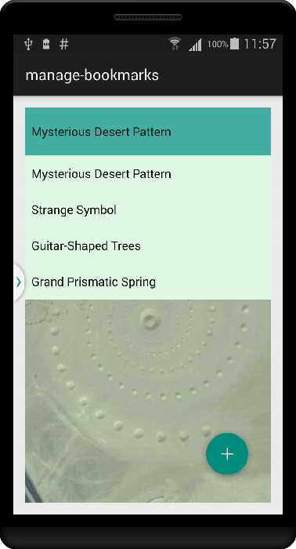
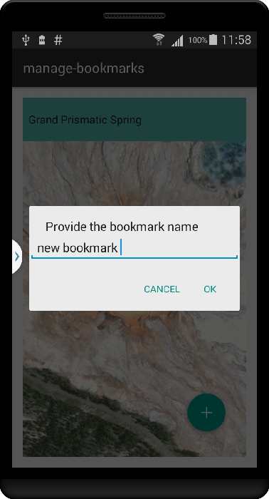

# Manage BookMarks




The sample demonstrates how to access and add bookmarks to a map

## Features
* ArcGISMap
* MapView
* BookmarkList
* Bookmark
* Viewpoint

## How to use the sample
This sample already has some bookmarks added to the map. You can tap on the spinner bar on the top to access these bookmarks. When the bookmark is selected the MapView is updated to show the viewpoint associated with the bookmark. To add a new bookmark pan/zoom in to the new location for the bookmark. Tap on the floating action button, which will pop up a dialog box where you can enter the name you want to give to this bookmark. When you tap ok the new bookmark will be created and it will show up in the spinner list.

## Developer Pattern
### BookmarkList     
LayerList represents the bookmarks of a Map. You can add and remove bookmarks from this list.      


```java
private BookmarkList mBookmarks;
private Bookmark mBookmark;
private Viewpoint mViewpoint;

....
// get the maps BookmarkList
mBookmarks = mMap.getBookmarks();

....
// add default bookmark
//Mysterious Desert Pattern
mViewpoint = new Viewpoint(27.3805833, 33.6321389, 6e3);
mBookmark = new Bookmark("Mysterious Desert Pattern", mViewpoint);
mBookmarks.add(mBookmark);
// Set the viewpoint to the default bookmark selected in the spinner
mMapView.setViewpointAsync(mViewpoint);


....
/**
* add a new bookmark at the location being displayed in the MapView's current Viewpoint
* @param Name of the bookmark
*/
void addBookmark(String Name) {

 mBookmark = new Bookmark(Name, mMapView.getCurrentViewpoint(ViewpointType.BOUNDING_GEOMETRY));
 mBookmarks.add(mBookmark);
 mBookmarksSpinnerList.add(Name);
 mDataAdapter.notifyDataSetChanged();
 }


```
