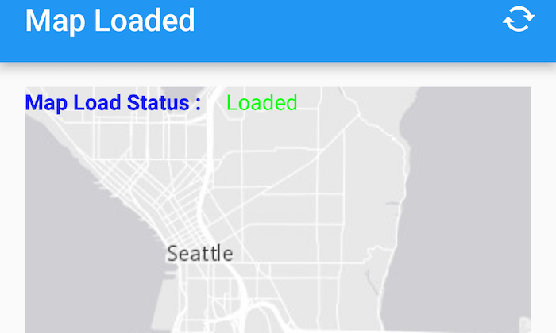

# Map Load Status
This sample shows how to tell what the map's load status is. This is obtained from the enum value from a ```LoadStatus``` class. The LoadStatus is considered loaded when any of the following are true:
* The map has a valid spatial reference
* The map has an an initial viewpoint
* One of the map's predefined layers has been created.

A signal handler is set up on the map to handle the ```LoadStatusChangedEvent``` signal, and the status text is updated when the status changes.



## Features

* Map
* MapView
* LoadStatusChangedListener

## Developer Pattern

The ```adddLoadStatusChangedListener``` method of class ```ArcGISMap``` listens for ```LoadStatusChangedEvent```. To get the load status use method ```getNewLoadStatus().name()``` on the changed event.
```java
// Listener on change in map load status
        mMap.addLoadStatusChangedListener(new LoadStatusChangedListener() {
            @Override
            public void loadStatusChanged(LoadStatusChangedEvent loadStatusChangedEvent) {
                String mapLoadStatus;
                mapLoadStatus = loadStatusChangedEvent.getNewLoadStatus().name();
                // map load status can be any of LOADING, FAILED_TO_LOAD, NOT_LOADED or LOADED
                // set the status in the TextView accordingly
                switch (mapLoadStatus) {
                    case "LOADING":
                        mMapLoadStatusTextView.setText(R.string.status_loading);
                        mMapLoadStatusTextView.setTextColor(Color.BLUE);
                        break;

                    case "FAILED_TO_LOAD":
                        mMapLoadStatusTextView.setText(R.string.status_loadFail);
                        mMapLoadStatusTextView.setTextColor(Color.RED);
                        break;

                    case "NOT_LOADED":
                        mMapLoadStatusTextView.setText(R.string.status_notLoaded);
                        mMapLoadStatusTextView.setTextColor(Color.GRAY);
                        break;

                    case "LOADED":
                        mMapLoadStatusTextView.setText(R.string.status_loaded);
                        mMapLoadStatusTextView.setTextColor(Color.GREEN);
                        break;

                    default :
                        mMapLoadStatusTextView.setText(R.string.status_loadError);
                        mMapLoadStatusTextView.setTextColor(Color.WHITE);
                        break;
                }

                Log.d(TAG,mapLoadStatus);
            }
        });
        // set the map to be displayed in this view
        mMapView.setMap(mMap); 
```
