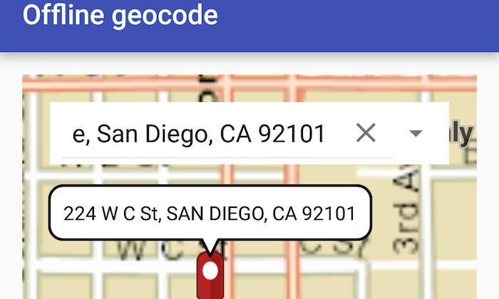

# Offline geocode
This sample demonstrates how you can geocode addresses to locations and reverse geocode locations to addresses when the device does not have network connectivity



## Features
- LocatorTask
- GeocodeResult
- GeocodeParameters
- ReverseGeocodeParameters

## How to use the sample
Type the address in the Search menu option or select from the list to `Geocode` the address and view the result on the map. Long-press on the location you want to Reverse Geocode. Selecting the output pin enables real-time reverse geocoding. Select the pin to highlight the `PictureMarkerSymbol` and tap-hold and drag on the map to get real-time geocoding.

## Developer Pattern
Use the path of SanFrancisco.loc to create an object of `LocatorTask`. Set up `GeocodeParameters` and run asynchronous method geoCodeAsync to get GeocodeResults. Methods ```getDisplayLocation()``` and `getLabel()` on geocode results is then used to fetch location and address.

```java
// Execute async task to find the address
        mLocatorTask.addDoneLoadingListener(new Runnable() {
            @Override
            public void run() {
                if (mLocatorTask.getLoadStatus() == LoadStatus.LOADED) {
                    // Call geocodeAsync passing in an address
                    final ListenableFuture<List<GeocodeResult>> geocodeFuture = mLocatorTask.geocodeAsync(address,
                            mGeocodeParameters);
                    geocodeFuture.addDoneListener(new Runnable() {
                        @Override
                        public void run() {
                            try {
                                // Get the results of the async operation
                                List<GeocodeResult> geocodeResults = geocodeFuture.get();

                                if (geocodeResults.size() > 0) {
                                    // Use the first result - for example
                                    // display on the map
                                    mGeocodedLocation = geocodeResults.get(0);
                                    displaySearchResult(mGeocodedLocation.getDisplayLocation(), mGeocodedLocation.getLabel());

                                } else {
                                    Toast.makeText(getApplicationContext(),
                                            getString(R.string.location_not_foud) + address,
                                            Toast.LENGTH_LONG).show();
                                }
                            } catch (InterruptedException|ExecutionException e) {
                                // Deal with exception...
                                e.printStackTrace();
                            }
                            geocodeFuture.removeDoneListener(this);
                        }
                    });
                }
            }
        });
        mLocatorTask.loadAsync();
```
On similar basis, after setting up ```ReverseGeocodeParameters```, ```LocatorTask.reverseGeocodeAsync``` returns a list of geocode results.

## Provision your device
The sample depends on basemap data to be located on the device. This includes installing a local tile map cache (tpk) to device as described below:

1. Download the data from the table below. 
2. Extract the contents of the downloaded zip file to disk. 
3. Create an ArcGIS/samples/OfflineGeocoding folder on your device. You can use the [Android Debug Bridge (adb)](https://developer.android.com/guide/developing/tools/adb.html) tool found in **<sdk-dir>/platform-tools**.
4. Open up a command prompt and execute the ```adb shell``` command to start a remote shell on your target device.
5. Navigate to your sdcard directory, e.g. ```cd /sdcard/```.  
6. Create the ArcGIS/samples/FLGdb directory, ```mkdir ArcGIS/samples/OfflineGeocoding```.
7. You should now have the following directory on your target device, ```/sdcard/ArcGIS/samples/OfflineGeocoding```. We will copy the contents of the downloaded data into this directory. Note:  Directory may be slightly different on your device.
8. Exit the shell with the, ```exit``` command.
9. While still in your command prompt, navigate to the folder where you extracted the contents of the data from step 1 and execute the following command: 
	* ```adb push streetmap_SD.tpk /sdcard/ArcGIS/samples/OfflineGeocoding```
	* ```adb push san-diego-locator.loc /sdcard/ArcGIS/samples/OfflineGeocoding```
	* ```adb push san-diego-locator.locb /sdcard/ArcGIS/samples/OfflineGeocoding```
	* ```adb push san-diego-locator.lox /sdcard/ArcGIS/samples/OfflineGeocoding```
	* ```adb push san-diego-locator.loc.x /sdcard/ArcGIS/samples/OfflineGeocoding```
	
Link     | Local Location
---------|-------|
|[San Diego Streets Tile Package](http://www.arcgis.com/home/item.html?id=1330ab96ac9c40a49e59650557f2cd63)| `<sdcard>`/ArcGIS/samples/OfflineGeocoding/streetmap_SD.tpk |
|[San Diego Offline Locator](http://www.arcgis.com/home/item.html?id=344e3b12368543ef84045ef9aa3c32ba)| `<sdcard>`/ArcGIS/samples/OfflineGeocoding/san-diego-locator.loc |