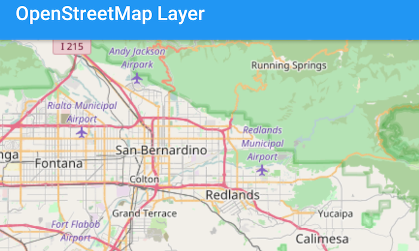

# OpenStreetMap Layer



This sample demonstrates how to add the OpenStreetMap layer to a map as a Basemap.

## Features
* ArcGISMap
* Basemap
* MapView

## Developer Pattern
An `Map` is declared and a `BasemapOpenStreetMap` object is nested as a child of the `Map`. This automatically sets the `Map's` `Basemap` as the OpenStreetMap basemap. `BasemapOpenStreetMap` is a helper QML type that creates a `Basemap` object that automatically appends the `OpenStreetMapLayer` as a baseLayer of the basemap. The attribution text that is required by OpenStreetMap is automatically added to the `MapView's` attributionText without any additional code.

```java
// instantiate an ArcGISMap with OpenStreetMap Basemap
ArcGISMap map = new ArcGISMap(Basemap.Type.OPEN_STREET_MAP, 34.056295, -117.195800, 10);
mMapView.setMap(map);
```