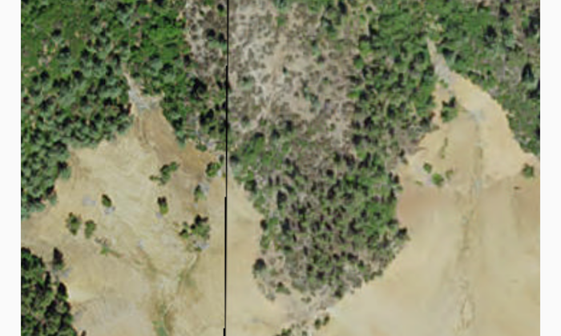

# Raster Layer File

Demonstrates how to create and use a raster layer made from a local raster file.

## How it works

To add a `RasterLayer` as an operational layer from a local raster file:

- Create a `Raster` from a raster file.
- Create a <code>RasterLayer</code> from the `Raster`.
- Add it as an operational layer with `map.getOperationalLayers().add(rasterLayer)`.

## Features
- Raster
- RasterLayer

## Provision your device
1. Download the **raster-file.zip** data from [ArcGIS Online](https://arcgisruntime.maps.arcgis.com/home/item.html?id=7c4c679ab06a4df19dc497f577f111bd).  
2. Extract the contents of the downloaded zip file to disk.  
3. Create an ArcGIS/samples/raster folder on your device. You can use the [Android Debug Bridge (adb)](https://developer.android.com/guide/developing/tools/adb.html) tool found in **<sdk-dir>/platform-tools**.
4. Open up a command prompt and execute the `adb shell` command to start a remote shell on your target device.
5. Navigate to your sdcard directory, e.g. `cd /sdcard/`.  
6. Create the ArcGIS/samples directory, `mkdir ArcGIS/samples/raster`.
7. You should now have the following directory on your target device, `/sdcard/ArcGIS/samples/raster`. We will copy the contents of the downloaded data into this directory. Note:  Directory may be slightly different on your device.
8. Exit the shell with the, `exit` command.
9. While still in your command prompt, navigate to the root folder where you extracted the contents of the data from step 1 and execute the following command: 
	* `adb push raster-file/. /sdcard/ArcGIS/samples/raster`

Link | Local Location
---------|-------|
|[raster-file.zip](https://arcgisruntime.maps.arcgis.com/home/item.html?id=7c4c679ab06a4df19dc497f577f111bd)| `<sdcard>`/ArcGIS/samples/raster/Shasta.tif |