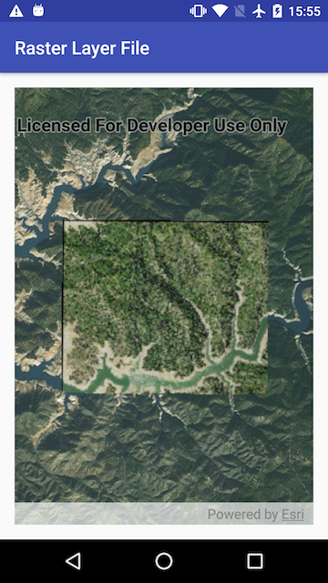

<h1>Raster Layer File</h1>

<p>Demonstrates how to create and use a raster layer made from a local raster file.</p>

<p></p>

<h2>How it works</h2>

<p>To add a <code>RasterLayer</code> as an operational layer from a local raster file:</p>
<ol>
  <li>Create a <code>Raster</code> from a raster file.</li>
  <li>Create a <code>RasterLayer</code> from the <code>Raster</code>.</li>
  <li>Add it as an operational layer with <code>map.getOperationalLayers().add(rasterLayer)</code>.</li>
</ol>

<h2>Features</h2>

<ul>
  <li>ArcGISMap</li>
  <li>Basemap</li>
  <li>MapView</li>
  <li>Raster</li>
  <li>RasterLayer</li>
</ul>


## Provision your device
1. Download the data from [TBD](https://TBD.com).  
2. Extract the contents of the downloaded zip file to disk.  
3. Create an ArcGIS/samples folder on your device. You can use the [Android Debug Bridge (adb)](https://developer.android.com/guide/developing/tools/adb.html) tool found in **<sdk-dir>/platform-tools**.
4. Open up a command prompt and execute the ```adb shell``` command to start a remote shell on your target device.
5. Navigate to your sdcard directory, e.g. ```cd /sdcard/```.  
6. Create the ArcGIS/samples directory, ```mkdir ArcGIS/samples/raster```.
7. You should now have the following directory on your target device, ```/sdcard/ArcGIS/samples/raster```. We will copy the contents of the downloaded data into this directory. Note:  Directory may be slightly different on your device.
8. Exit the shell with the, ```exit``` command.
9. While still in your command prompt, navigate to the root folder where you extracted the contents of the data from step 1 and execute the following command: 
	* ```adb push raster/. /sdcard/ArcGIS/samples/raster```


Link | Local Location
---------|-------|
|[Shasta](https://TBD.com)| `<sdcard>`/ArcGIS/samples/raster/Shasta.tif |