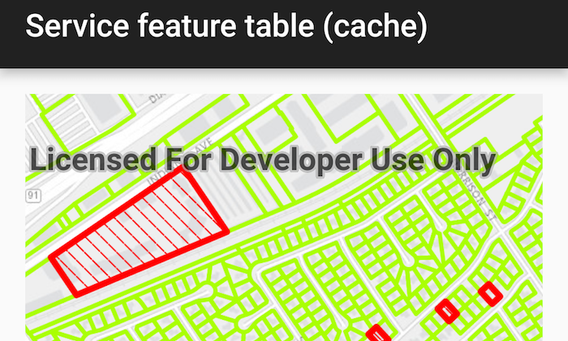

# Service feature table (cache)
This sample demonstrates how to use a feature service with a service feature table in on-interaction-cache mode (which is the default mode for service feature tables). 



## How it works
Set the ```ServiceFeatureTable.FeatureRequestMode``` property of the service feature table to ```ON_INTERACTION_CACHE``` before the table is loaded. The mode cannot be changed once the table has been loaded.
