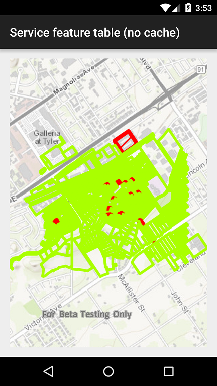

#Service feature table (no cache)



##

This sample demonstrates how to use a feature service in on-interaction-no-cache mode. This mode always fetches features from the server and does not cache features client side.
###

By setting the ```ServiceFeatureTable.FeatureRequestMode``` to ```ON_INTERACTION_NO_CACHE``` on an service feature table before it is loaded.
