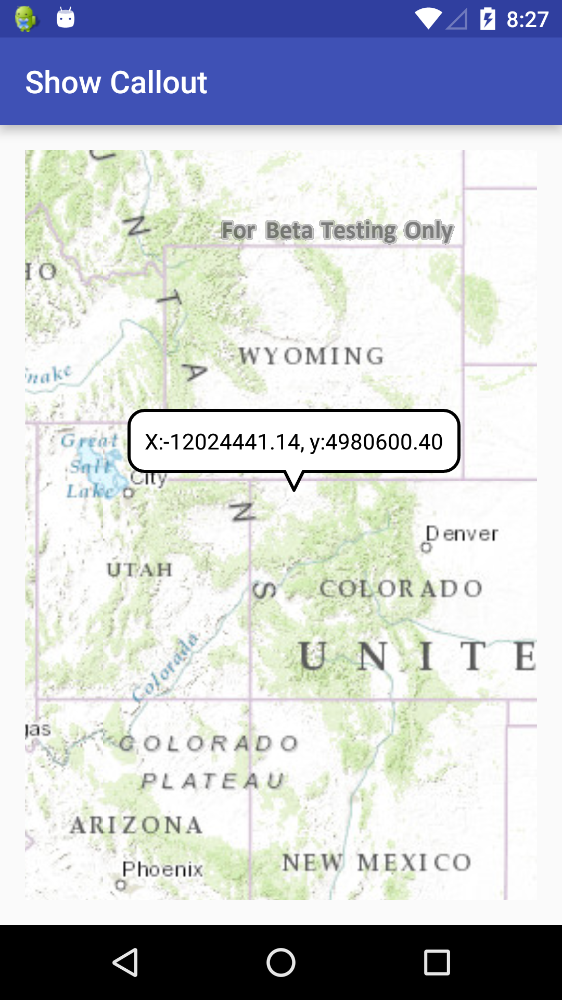

# Show Callout
The **Show Callout** sample draws a callout on a MapView and manages its behavior. A callout displays an Android View that contains text and/or other content. It has a leader that points to the location the callout refers to. 



## Features
* ArcGISMap
* MapView
* Callout

## Developer Pattern
The pattern demonstrates how to show location coordinates on a `MapView` using a `Callout`.  The sample converts screen coordinates to location coordinates to show the location of the callout.  The content of the callout is created programmatically by an Android `TextView`.

```java
// create a textview for the callout
TextView calloutContent = new TextView(getApplicationContext());
calloutContent.setTextColor(Color.BLACK);
calloutContent.setSingleLine();
// format coordinates to 4 decimal places
 calloutContent.setText("Lat: " +  String.format("%.4f", wgs84Point.getY()) +
        ", Lon: " + String.format("%.4f", wgs84Point.getX()));

// get callout, set content and show
mCallout = mMapView.getCallout();
mCallout.setLocation(mapPoint);
mCallout.setContent(calloutContent);
mCallout.show();

// center on tapped point
mMapView.setViewpointCenterAsync(mapPoint);
```
