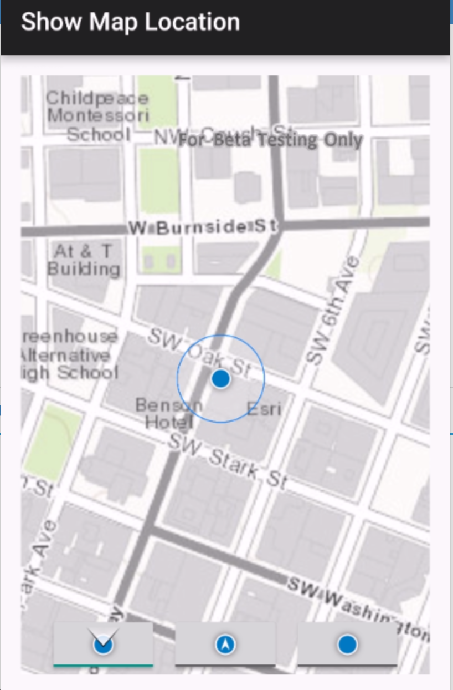

# Show Initial Map Location

The **Show Initial Map Location** app is an extension of the set-inital-map-location app for the [ArcGIS Runtime SDK for Android](https://developers.arcgis.com/en/android/).
It shows how to manage the display of a current location in the MapView and how different pan modes can be used.  This app requires location tracking on your device to be turned on.
## Features
* Map
* MapView
* BasemapType
* LocationDisplay
* AutoPanMode
