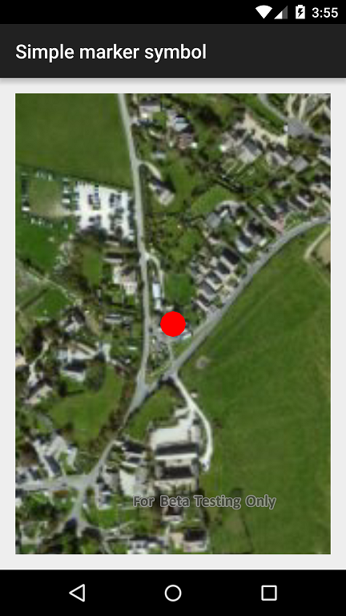

#Simple marker symbol

##

This sample adds a graphic to a graphics overlay with a symbol of a red point specified via a simple marker symbol.
How it works
A point geometry is created from some known coordinates, a simple marker symbol is constructed and both are set on a graphic. The graphic is added to a graphics overlay in the map view so that it is visible.
